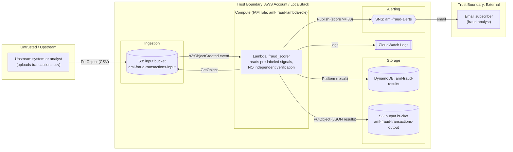
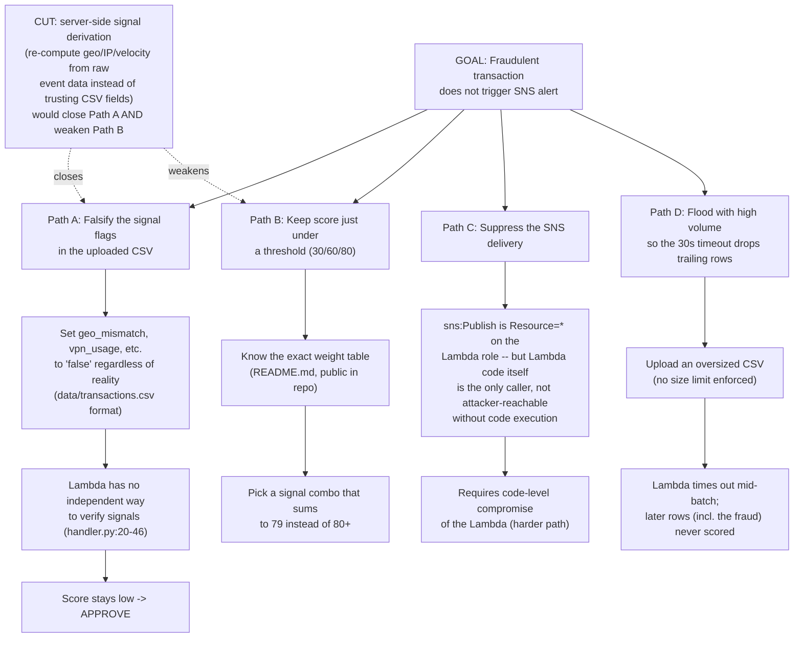

# Threat Model — AML Fraud Detection Pipeline (AWS)

**Owner:** Giovanny Galindo
**Version:** 1.0
**Date:** 2026-09-22
**Reviewed by:** pending peer review
**Next review:** 2027-09-22, or sooner on any architecture change

**Status:** lab/portfolio project. **Not a production security assessment.**
**Analyzed at commit:** branch `docs/threat-model`, code under `terraform/`, `lambda/`, `scripts/`, `data/`.

## 1. Scope and system description

This project is an event-driven transaction-scoring pipeline built entirely with Terraform on AWS, designed to run locally against LocalStack (`terraform/provider.tf:16-23`) and optionally against real AWS.

Flow: a CSV of transactions is uploaded to an S3 "input" bucket. That upload triggers a Lambda function that reads the CSV, computes a risk score per transaction from pre-labeled boolean signals in the CSV itself, writes the result to DynamoDB and to an S3 "output" bucket, and publishes an SNS alert when the score is high.

In scope for this threat model:
- `terraform/*.tf` (S3, DynamoDB, SNS, IAM, Lambda)
- `lambda/handler.py` (scoring logic and AWS SDK calls)
- `scripts/test_pipeline.py` and `data/transactions.csv` (how data enters the system)

Out of scope: LocalStack/Docker itself, the developer's laptop, and any real production deployment (this code has never been applied to a real AWS account as far as this review can tell).

## 2. Deployment verification (LocalStack)

Docker Desktop was available on the analysis machine, so LocalStack was pulled to deploy and diff against the code. `localstack/localstack:latest` refused to start — it now requires a paid LocalStack auth token even for community services (license-activation error, container exited with code 55). Pinning to the last fully free community image, `localstack/localstack:3.8`, started cleanly and reported `"edition": "community"` with `s3`, `lambda`, `dynamodb`, `sns`, `iam`, `logs`, `cloudwatch` all `"available"`.

`terraform apply` against that container was **not executed** — the session's own safety controls flagged an unreviewed `terraform apply` as a blind/unattended infrastructure change and asked for explicit confirmation first; the user opted for **code-only analysis** for this repo rather than approving the live apply. So the asset inventory and findings below are derived entirely from static analysis of the Terraform, Lambda, and test-script source, not from an observed running stack. This is noted rather than glossed over, per the "be honest" instruction for this exercise.

## 3. Asset inventory (from Terraform + Lambda code)

| Asset | Resource | Source | Notes |
|---|---|---|---|
| Raw transaction data (financial, includes `customer_id`, `amount`, behavioral flags) | `aws_s3_bucket.input` (`aml-fraud-transactions-input`) | `terraform/main.tf:7-9` | No encryption, versioning, logging, or public-access-block resource defined |
| Scored output (fraud decisions per customer) | `aws_s3_bucket.output` (`aml-fraud-transactions-output`) | `terraform/main.tf:12-14` | Same — no hardening resources |
| Decision history / audit trail | `aws_dynamodb_table.results` (`aml-fraud-results`, PK `transaction_id`) | `terraform/main.tf:31-40` | No point-in-time recovery, no encryption customization (defaults apply) |
| Fraud alerting channel | `aws_sns_topic.alerts` + email subscription | `terraform/main.tf:45-54` | Subscriber is a placeholder test address (`variables.tf:27`) |
| Scoring compute | `aws_lambda_function.fraud_scorer` | `terraform/main.tf:125-143` | Python 3.11, 30s timeout, env vars for table/bucket/topic names |
| Execution identity | `aws_iam_role.lambda_role` + inline `aws_iam_role_policy.lambda_policy` | `terraform/main.tf:59-104` | See §4 |
| S3→Lambda trigger permission | `aws_lambda_permission.allow_s3` | `terraform/main.tf:107-113` | Scoped to the input bucket ARN — correctly scoped |

**Data flow, condensed:** `data/transactions.csv` → `scripts/test_pipeline.py` uploads to S3 input bucket → S3 event → `lambda/handler.py` → DynamoDB + S3 output bucket → SNS (if score ≥ 80).

## 4. IAM inventory and permissions

Single role: `aml-fraud-lambda-role` (`terraform/main.tf:59-70`), assumable only by `lambda.amazonaws.com`. Its inline policy (`terraform/main.tf:76-104`):

| Statement | Actions | Resource | Assessment |
|---|---|---|---|
| S3 | `s3:GetObject`, `s3:PutObject` | Scoped to `.../aml-fraud-transactions-input/*` and `.../aml-fraud-transactions-output/*` | Correctly scoped |
| DynamoDB | `dynamodb:PutItem`, `dynamodb:GetItem` | `"*"` | **Over-broad** — should be the single table's ARN |
| SNS | `sns:Publish` | `"*"` | **Over-broad** — should be the single topic's ARN |
| Logs | `logs:CreateLogGroup`, `logs:CreateLogStream`, `logs:PutLogEvents` | `"*"` | Acceptable in practice (CloudWatch Logs actions are commonly left unscoped since log group ARNs aren't known until runtime), but could be scoped to `/aws/lambda/aml-fraud-scorer*` |

No other IAM roles, users, or resource policies exist in this codebase. No S3 bucket policies restrict who can call the two scoped-but-unauthenticated-at-the-bucket-policy-level buckets — access control rests entirely on IAM identity policy, which is fine for a single-role lab setup but has no defense in depth.

## 5. Data flow diagram

Trust boundary of note: the CSV's own boolean fields (`geo_mismatch`, `vpn_usage`, etc. — see `data/transactions.csv:1`) cross straight from "Untrusted / Upstream" into the scoring decision with no re-derivation inside the trust boundary. That is the system's real trust boundary violation, not the network topology.

## 6. Shared responsibility by AWS service used

| Service | AWS manages | Customer (this project) manages |
|---|---|---|
| S3 | Hardware, durability, availability, patching | Bucket policy, encryption config, versioning, public-access block, access logging — **none of these are set in this repo** |
| Lambda | Runtime patching, host isolation, scaling | Function code, IAM execution role scope, env var secrets, timeout/memory, input validation (**input validation is absent**) |
| DynamoDB | Server/storage management, replication | Table schema, access policy, encryption choice, backup/PITR (**PITR not enabled**) |
| SNS | Message delivery infrastructure | Topic access policy, subscriber protocol/endpoint validation |
| IAM | Service uptime | Least-privilege policy authoring (**not fully least-privilege — see §4**) |
| CloudWatch Logs | Log storage/availability | Log retention policy (**not set — defaults to "never expire"**), what gets logged (this code logs full transaction rows via `print()`, `lambda/handler.py:66,73,101,104`) |

## 7. STRIDE — main flow (CSV upload → score → alert)

| Threat | Component | Existing control | Gap |
|---|---|---|---|
| **Spoofing** | Uploader identity for `PutObject` to input bucket | IAM identity policy (implicit, not shown in this repo) | No bucket policy, no MFA-delete, no CloudTrail resource in this IaC to attribute who actually uploaded a file |
| **Tampering** | Risk signals inside the CSV (`lambda/handler.py:20-46`) | None | **Core finding.** The Lambda trusts `geo_mismatch`, `vpn_usage`, `chargeback_history`, etc. as given, rather than deriving them from raw event data (IP, device, account history). Anyone who can write the input file controls the score outright |
| **Tampering** | Lambda→DynamoDB / Lambda→S3 writes | IAM scoping (partial, see §4) | `dynamodb:PutItem`/`sns:Publish` are unscoped (`Resource = "*"`), so a compromised Lambda could act on any table/topic in the account, not just this project's |
| **Repudiation** | Who uploaded/altered a transaction file | CloudWatch logs of Lambda execution only | No S3 access logging or CloudTrail data events configured — can't reconstruct "who put this object" |
| **Information Disclosure** | Transaction data at rest (amounts, customer IDs, fraud signals) | Default S3/DynamoDB encryption (AWS-owned keys) | No customer-managed KMS key, no bucket encryption block declared explicitly, no PITR/backup encryption review |
| **Information Disclosure** | Full transaction payloads logged via `print()` | None | `lambda/handler.py:66,73,101,104` writes transaction content (including `customer_id`, `amount`, computed score) straight to CloudWatch Logs, which has no retention limit set — PII/financial data persists indefinitely in logs |
| **Denial of Service** | Lambda timeout vs. file size | `timeout = 30` (`terraform/main.tf:132`) | No file-size cap on S3 uploads, no batching/streaming in `handler.py` — a large CSV can exhaust the 30s timeout, silently dropping the tail of a batch with no partial-failure handling |
| **Elevation of Privilege** | Lambda execution role | Scoped S3 actions | `Resource = "*"` on DynamoDB/SNS actions gives the function reach beyond what it needs (see §4) |

## 8. Attack tree — "A fraudulent transaction does not trigger the alert"

**Which control cuts the most branches:** none currently exists in the code, but the single highest-leverage fix is **server-side signal derivation** (compute `geo_mismatch`, `vpn_usage`, etc. from authoritative data — IP geolocation, device fingerprint, account history in DynamoDB — instead of reading them as pre-set booleans from the input file). That one change closes Path A entirely and makes Path B much harder, since an attacker could no longer just declare favorable signal values.

## 9. Findings

| ID | Finding | Severity | Evidence | Risk | Remediation |
|---|---|---|---|---|---|
| F-01 | Risk signals are trusted directly from the input CSV instead of being derived by the system | **Critical** | `lambda/handler.py:20-46`; sample data `data/transactions.csv:1` | Whoever controls the upload controls the fraud decision — this is not fraud *detection*, it's fraud *label aggregation*. Complete evasion is trivial | Compute signals server-side from raw event attributes (source IP, device, account velocity from DynamoDB history) instead of accepting them as CSV columns |
| F-02 | IAM policy grants `dynamodb:PutItem`/`GetItem` and `sns:Publish` on `Resource = "*"` | High | `terraform/main.tf:86-93` | Violates least privilege; a compromised or buggy Lambda could write to any DynamoDB table or publish to any SNS topic in the account | Scope to `aws_dynamodb_table.results.arn` and `aws_sns_topic.alerts.arn` |
| F-03 | Full transaction records (customer ID, amount, score) are logged via `print()` with no CloudWatch Logs retention policy | Medium | `lambda/handler.py:66,73,101,104` | Financial/PII data persists indefinitely in logs, outside the "official" data stores that were designed with access control in mind | Log identifiers/decisions only, not full payloads; set explicit log retention (`aws_cloudwatch_log_group` with `retention_in_days`) |
| F-04 | S3 buckets have no encryption, versioning, public-access-block, or access-logging resources declared | Medium | `terraform/main.tf:7-14` (no accompanying `aws_s3_bucket_*` hardening resources anywhere in `terraform/`) | Relies entirely on account-level defaults; no protection against accidental public exposure or silent overwrite/delete of evidence data | Add `aws_s3_bucket_public_access_block`, `aws_s3_bucket_versioning`, `aws_s3_bucket_server_side_encryption_configuration` |
| F-05 | No input size/row limit on the uploaded CSV vs. a fixed 30s Lambda timeout | Low | `terraform/main.tf:132`; `lambda/handler.py:62-104` (no chunking/streaming) | Large uploads can time out mid-batch with no partial-failure handling, silently leaving later transactions (possibly the fraudulent one) unscored | Stream/paginate processing, or move to SQS + batched Lambda invocations with a DLQ |
| F-06 | DynamoDB table has no point-in-time recovery configured | Low | `terraform/main.tf:31-40` | Accidental or malicious deletion of the audit trail is unrecoverable | Add `point_in_time_recovery { enabled = true }` |
| F-07 | `terraform apply` against LocalStack could not be verified in this review (see §2) | Info | N/A | Findings above are code-derived, not confirmed against a running stack; real deployed behavior could differ if manual console changes were ever made | Re-run this review with an approved `terraform apply` + `awslocal` inspection to confirm code matches reality |

## 10. Final note

This is a lab/portfolio project built to practice AML fraud-detection architecture and Terraform, not a production system and not a regulated financial institution's actual pipeline. The findings above are written the way they would be for a real assessment so they're useful practice, but nothing here implies real customer data, a live AWS account, or an active compliance obligation.
